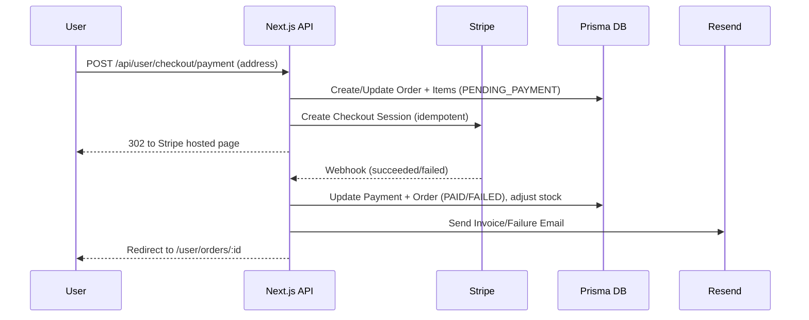

# Modern E‑commerce Platform (Next.js, Prisma, Stripe, Algolia, Cloudinary, Resend)

A production‑ready e‑commerce application built on Next.js App Router with a robust domain model, modern UI, secure authentication, real‑time search, reliable payments, and operational observability. Designed for scale, maintainability, and a great developer experience.

## Highlights

- **End‑to‑end commerce**: catalog, variants, cart, checkout, orders, reviews, payments.
- **Enterprise‑grade integrations**:
  - **Stripe** for payments and saved cards with idempotent, reconciled webhooks.
  - **Algolia** for instant search with indexed replicas and typed indexers.
  - **Cloudinary** for media storage and on‑the‑fly transformations.
  - **Resend** for transactional emails (verification, invoices, failures).
- **Secure auth** with NextAuth (Credentials + Google OAuth), email verification, account lockout, and JWT sessions.
- **Observability by default**: request correlation via `x-request-id`, structured logs, and response timing headers in `src/middleware.ts`.
- **Typed APIs** with consistent response envelopes and error normalization.

## Tech Stack

- **Web**: Next.js 15 (App Router), React 19, TypeScript, Tailwind CSS 4, Radix UI, shadcn/ui, lucide icons.
- **Server & Data**: Prisma ORM (`sqlite` dev default), Pino logger, Zod, Axios.
- **Auth**: NextAuth (credentials + Google), bcryptjs.
- **Search**: Algolia (browser + admin SDKs).
- **Emails**: Resend.
- **Media**: Cloudinary.
- **Payments**: Stripe (Checkout + Setup Intents).
- **Testing**: Jest (+ jsdom) and Playwright.

## Directory Overview

- **`src/app/`**: App Router pages and API routes (e.g., `src/app/api/user/...`).
- **`src/features/`**: Domain modules for user and admin experiences.
- **`src/lib/`**: Integrations and shared utilities (Stripe, Algolia, Cloudinary, mail, logging, API helpers).
- **`prisma/`**: Database schema and seeds; run migrations with Prisma CLI.
- **`src/middleware.ts`**: Authz/allowlists, request ID propagation, and response timing.

## Development Philosophy

We follow a feature-based, DDD‑inspired architecture (Catalog, Cart, Checkout, Orders, Payments, Support). Principles: consistent API contracts, idempotency‑first flows (payments, stock), strong observability (request correlation + structured logs), and testability by isolating pure, typed utilities.

## Key Source Links (GitHub‑friendly)

- **Auth**
  - [`src/lib/authOptions.ts`](src/lib/authOptions.ts)
  - [`src/app/api/auth/%5B...nextauth%5D/route.ts`](src/app/api/auth/%5B...nextauth%5D/route.ts)
  - [`src/app/api/auth/signup/route.ts`](src/app/api/auth/signup/route.ts)
  - [`src/app/api/auth/verify-email/route.ts`](src/app/api/auth/verify-email/route.ts)
  - [`src/app/api/auth/forgot-password/route.ts`](src/app/api/auth/forgot-password/route.ts)
  - [`src/app/api/auth/reset-password/route.ts`](src/app/api/auth/reset-password/route.ts)
  - [`src/app/api/auth/reset-password/validate/route.ts`](src/app/api/auth/reset-password/validate/route.ts)

- **Payments (Stripe)**
  - [`src/app/api/user/checkout/payment/route.ts`](src/app/api/user/checkout/payment/route.ts)
  - [`src/app/api/user/stripe/webhook/route.ts`](src/app/api/user/stripe/webhook/route.ts)
  - [`src/app/api/user/profile/payment/save-method/route.ts`](src/app/api/user/profile/payment/save-method/route.ts)
  - [`src/lib/stripeClient.ts`](src/lib/stripeClient.ts)
  - [`src/lib/stripe.ts`](src/lib/stripe.ts)

- **Search (Algolia)**
  - [`src/app/api/user/search/route.ts`](src/app/api/user/search/route.ts)
  - [`src/lib/algolia.search/algolia.client.ts`](src/lib/algolia.search/algolia.client.ts)
  - [`src/lib/algolia.search/algolia.server.ts`](src/lib/algolia.search/algolia.server.ts)
  - [`src/lib/algolia.search/constants.ts`](src/lib/algolia.search/constants.ts)

- **Media (Cloudinary)**
  - [`src/lib/cloudinary.ts`](src/lib/cloudinary.ts)
  - [`src/app/api/admin/upload/route.ts`](src/app/api/admin/upload/route.ts)

- **Emails (Resend)**
  - [`src/lib/mail.ts`](src/lib/mail.ts)
  - [`src/lib/emailTemplates.ts`](src/lib/emailTemplates.ts)

- **API Patterns & Observability**
  - [`src/lib/apiResponse.ts`](src/lib/apiResponse.ts)
  - [`src/lib/http/normalizeError.ts`](src/lib/http/normalizeError.ts)
  - [`src/lib/request-log.ts`](src/lib/request-log.ts)
  - [`src/lib/logger.ts`](src/lib/logger.ts)
  - [`src/middleware.ts`](src/middleware.ts)

- **Catalog & Reviews**
  - [`src/app/api/user/products/route.ts`](src/app/api/user/products/route.ts)
  - [`src/app/api/user/products/filters/route.ts`](src/app/api/user/products/filters/route.ts)
  - [`src/app/api/user/products/%5Bid%5D/route.ts`](src/app/api/user/products/%5Bid%5D/route.ts)
  - [`src/app/api/user/products/%5Bid%5D/review/route.ts`](src/app/api/user/products/%5Bid%5D/review/route.ts)

- **Cart & Checkout**
  - [`src/app/api/user/cart/add/route.ts`](src/app/api/user/cart/add/route.ts)
  - [`src/app/api/user/cart/update/route.ts`](src/app/api/user/cart/update/route.ts)
  - [`src/app/api/user/cart/remove/route.ts`](src/app/api/user/cart/remove/route.ts)
  - [`src/app/api/user/cart/clear/route.ts`](src/app/api/user/cart/clear/route.ts)
  - [`src/app/api/user/cart/start-Checkout/route.ts`](src/app/api/user/cart/start-Checkout/route.ts)
  - [`src/app/api/user/checkout/route.ts`](src/app/api/user/checkout/route.ts)

- **Orders**
  - [`src/app/api/user/orders/route.ts`](src/app/api/user/orders/route.ts)
  - [`src/app/api/user/orders/%5Bid%5D/route.ts`](src/app/api/user/orders/%5Bid%5D/route.ts)
  - [`src/app/api/user/orders/cleanup/route.ts`](src/app/api/user/orders/cleanup/route.ts)

## UI & Theming

- **Brand tokens** centralized in `src/app/(pages)/globals.css` (e.g., `--color-primary`, `--color-foreground`, `--color-surface-strong`).
- Tailwind CSS v4 with CSS variables, Radix primitives, and shadcn/ui components.

## Data Model (Prisma)

Key models in `prisma/schema.prisma`:

- **Catalog**: `Product`, `ProductVariant`, `ProductImage`, `ProductVariantImage`, `Category`, `Brand`, `Color`, `Size`.
- **User & Identity**: `User`, `Address`, `Role`.
- **Commerce**: `CartItem` (unique by `[userId, productId, variantId]`), `Checkout` + `CheckoutItem`, `Order` + `OrderItem`, `Payment`, `PaymentMethod`.
- **Content & Support**: `Review`, `Support`, `SupportReply`.
- **Ops**: `Setting` (VAT, site name), `OrderStatusChange`.

### Core Models (Summary)

| Model               | Key Fields                                                                 | Relations |
|---------------------|-----------------------------------------------------------------------------|-----------|
| User                | `id`, `email`, `name`, `role`, `emailVerified`, `provider`, `stripeCustomerId` | `addresses`, `cartItems`, `checkout`, `orders`, `reviews`, `paymentMethods`, `supports` |
| Address             | `id`, `street`, `city`, `state`, `postalCode`, `country`                    | `user` -> User |
| Category            | `id`, `name`, `parentId`                                                    | `parent` -> Category, `children` -> Category[], `products` -> Product[] |
| Brand               | `id`, `name`                                                                | `products` -> Product[] |
| Product             | `id`, `name`, `price`, `salePrice`, `salePercent`, `shippingDuration`       | `category`, `brand`, `variants`, `images`, `reviews`, `orderItems` |
| ProductVariant      | `id`, `stock`, `price`, `salePrice`, `salePercent`                          | `product`, `color`, `size`, `images`, `orderItems` |
| ProductImage        | `id`, `url`, `publicId`                                                     | `product` |
| ProductVariantImage | `id`, `url`, `publicId`, `isPrimary`                                        | `variant` |
| Color               | `id`, `name`, `hexCode`                                                     | `variants` |
| Size                | `id`, `name`                                                                | `variants` |
| Review              | `id`, `rating`, `comment`                                                   | `product`, `user` |
| CartItem            | `id`, `quantity`, `productId`, `variantId`                                  | `user`, `product`, `variant` |
| Checkout            | `id`, `userId`, `orderId`                                                   | `user`, `items` -> CheckoutItem[] |
| CheckoutItem        | `id`, `productId`, `quantity`, `price`, `name`, `image`, `variantId`        | `checkout`, `variant` |
| Order               | `id`, `total`, `status`, `expiresAt`                                        | `user`, `items` -> OrderItem[], `statusChanges`, `payment` |
| OrderItem           | `id`, `quantity`, `price`, `productName`, `variantId`, `colorName`, `sizeName` | `order`, `product`, `variant` |
| Payment             | `id`, `orderId`, `amount`, `currency`, `status`, `stripePaymentId`, `paidAt` | `order`, `paymentMethod` (optional) |
| PaymentMethod       | `id`, `stripeMethodId`, `cardBrand`, `last4`, `expMonth`, `expYear`, `isDefault` | `user`, `payments` (via `paymentMethodId`) |
| Setting             | `id`, `siteName`, `vatRate`, `senderEmail`, `currency`                       | — |

> See the full schema in [`prisma/schema.prisma`](prisma/schema.prisma).

## Authentication & Security

- **NextAuth** credentials + Google OAuth configured in `src/lib/authOptions.ts`.
- **Security features**:
  - Email verification token flow via `/api/auth/verify-email`.
  - Password reset with token expiry and strength checks.
  - Account lockout after repeated failed sign‑ins.
  - OAuth‑only accounts cannot reset password via credentials.
- JWT session strategy; server uses `ServerSession()` helpers to guard routes.

## Search (Algolia)

- Client search initialized in `src/lib/algolia.search/algolia.client.ts` using `NEXT_PUBLIC_ALGOLIA_APP_ID` and `NEXT_PUBLIC_ALGOLIA_SEARCH_API_KEY`.
- Admin indexing client in `src/lib/algolia.search/algolia.server.ts` with `ALGOLIA_APP_ID` and `ALGOLIA_ADMIN_KEY`.
- Indexing endpoint: `POST /api/user/search` indexes products in chunks and configures replicas; `DELETE /api/user/search` clears. See `src/app/api/user/search/route.ts`.
- Middleware allows maintenance endpoints in dev or with `x-admin-token` matching `ADMIN_TASKS_TOKEN`.

## Media (Cloudinary)

- Cloudinary configured in `src/lib/cloudinary.ts` using env vars; Next.js image allowlist set in `next.config.ts` for `res.cloudinary.com`.
- Admin upload endpoint `POST /api/admin/upload` accepts `multipart/form-data` and returns normalized metadata.

## Emails (Resend)

- Resend client in `src/lib/mail.ts` with `sendMail()` abstraction.
- Invoice and failure templates in `src/lib/emailTemplates.ts` (Arabic RTL templates supported).
- Used across signup verification, password reset, and post‑payment notifications.

## Payments (Stripe)

- **Client**: `src/lib/stripeClient.ts` loads Stripe with `NEXT_PUBLIC_STRIPE_PK`.
- **Checkout**: `POST /api/user/checkout/payment` builds Stripe Checkout Session with idempotency, VAT line, and metadata linking to the order.
- **Webhooks**: `POST /api/user/stripe/webhook` validates signature, reconciles amounts, marks orders paid/failed, deducts stock idempotently, persists card brand/last4 when available, and sends invoice/failure emails.
- **Saved cards**: Create a Payment Method client‑side with Stripe Elements, then persist via `POST /api/user/profile/payment/save-method` (unique `(userId, stripeMethodId)`), with first card auto‑set as default.



## Roles & Capabilities

- **User**
  - Browse products with rich filters and search (categories, brands, colors, sizes, discounts).
  - Add to cart, prepare and review checkout, and pay via Stripe Checkout.
  - Track orders and invoices; retry failed payments.
  - Write and update product reviews.
  - Manage profile data and address; manage saved payment methods.

- **Admin**
  - Access an admin dashboard at `/admin` with role‑based protection.
  - Create and edit products, images, categories, and brands.
  - Manage orders and payments (status changes recorded and auditable).
  - Review user reviews and support tickets.
  - Control global settings (VAT, sender email, currency).
  - Trigger Algolia indexing and review structured logs (request ID, response time).

## Catalog, Cart, Checkout & Orders

- **Products**: Listing and filters at `GET /api/user/products` and `GET /api/user/products/filters` using shared utils. Product details `GET /api/user/products/[id]` returns only variant images and rating aggregates.
- **Reviews**: `POST /api/user/products/[id]/review` upserts by `(productId, userId)`.
- **Cart**: Add/update/remove/clear under `src/app/api/user/cart/*` with strict stock checks (variant‑first, then product aggregate).
- **Checkout**:
  - `POST /api/user/cart/start-Checkout` snapshots selected cart items into `CheckoutItem`s with effective discounts.
  - `GET /api/user/checkout` fetches prepared checkout; supports `?retry=<orderId>` flow for failed payments.
- **Orders**: `GET /api/user/orders` paginated list; `GET /api/user/orders/[id]` returns rich details; `POST /api/user/orders/cleanup` cancels expired unpaid orders.

## API Patterns & Observability

- **Response envelope**: `apiResponse(success, data, message, status)` from `src/lib/apiResponse.ts`.
- **Error normalization**: `normalizeError()` in `src/lib/http/normalizeError.ts`.
- **Request correlation**: `src/middleware.ts` issues `x-request-id` and `x-response-time`, with structured ingress/egress logs.

## Environment Variables

Create `.env.local` with the following (examples are placeholders):

```env
# App
NEXT_PUBLIC_APP_URL=http://localhost:3000
NEXT_PUBLIC_BASE_URL=http://localhost:3000
NEXT_PUBLIC_SITE_NAME=My Store

# Auth
NEXTAUTH_SECRET=your_nextauth_secret
GOOGLE_CLIENT_ID=your_google_client_id
GOOGLE_CLIENT_SECRET=your_google_client_secret

# Database
DATABASE_URL="file:./dev.db"  # Prisma (SQLite dev default)

# Stripe
NEXT_PUBLIC_STRIPE_PK=pk_test_xxx
STRIPE_SECRET_KEY=sk_test_xxx
STRIPE_WEBHOOK_SECRET=whsec_xxx

# Algolia
NEXT_PUBLIC_ALGOLIA_APP_ID=app_id
NEXT_PUBLIC_ALGOLIA_SEARCH_API_KEY=search_key
ALGOLIA_APP_ID=app_id
ALGOLIA_ADMIN_KEY=admin_key

# Cloudinary
CLOUDINARY_CLOUD_NAME=cloud_name
CLOUDINARY_API_KEY=api_key
CLOUDINARY_API_SECRET=api_secret

# Resend
RESEND_API_KEY=re_xxx

# Ops
ADMIN_TASKS_TOKEN=some-long-random-token
LOG_LEVEL=debug
```

> Security note: never commit real secrets to the repository. Use environment variables for all credentials.

## Local Development

- **Install**: `npm install`
- **DB migrate**: `npx prisma migrate dev`
- **Optional seed**: `npm run seed`
- **Dev**: `npm run dev` (http://localhost:3000)
- **Stripe webhook (dev)**:

```bash
stripe listen --forward-to localhost:3000/api/user/stripe/webhook
```

- **Index products to Algolia (dev/ops)**:
  - `POST /api/user/search` — build and upload the index
  - `DELETE /api/user/search` — clear the index
  - In production, send `x-admin-token: $ADMIN_TASKS_TOKEN` header.

### Seed Accounts (Dev)

- **Admin**: `admin@admin.com` / `a123456789A@`
- **User**: `user@user.com` / `a123456789A@`

These are created by the seed script in `prisma/seed.ts`. Run `npm run seed` after migrations. Do not use these credentials in production.

## Testing

- **Unit/Integration (Jest)**: `npm test`
  - Config: `jest.config.ts` (ts-jest, jsdom), setup files, path aliases.
- **E2E (Playwright)**: `npx playwright test`
  - Config: `playwright.config.ts` spins up the dev server and loads env from `tests/env.test`.

## Deployment

- Next.js project; can be deployed to Vercel or any Node hosting.
- Ensure all env vars are set in the target environment (see above).
- `next.config.ts` whitelists remote images from Cloudinary and Picsum.

## Why This Matters to Companies

- **Reliability**: Idempotent payment creation, webhook reconciliation, and stock adjustments protect against duplicates.
- **Security**: Strong auth flows, role‑based middleware, and structured redaction in logs.
- **Performance**: Server‑side pagination and aggregation, background indexing, and CDN‑ready images.
- **Maintainability**: Feature‑oriented folders, typed utilities, shared API patterns, and cohesive logging.

---

If you have questions about specific modules, see the cited files above or the `src/features/` directory for domain‑oriented code.
